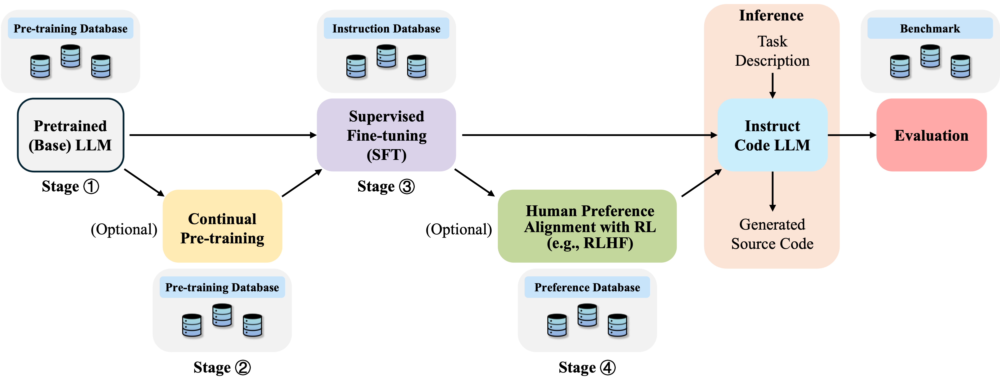
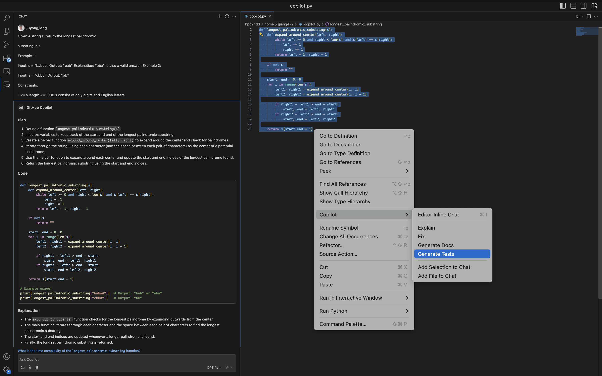

<div align="center">
  <h1>:robot: Code LLMs Survey</h1>
  <a href="https://awesome.re">
    
  </a>
  <a href="https://img.shields.io/badge/PRs-Welcome-red">
    
  </a>
  <a href="https://img.shields.io/github/last-commit/juyongjiang/CodeLLMSurvey?color=green">
    
  </a>
</div>



> [!IMPORTANT]
> 
> A curated collection of papers and resources on Large Language Models for Code Generation.
> 
> Please refer to our survey [**"A Survey on Large Language Models for Code Generation"**](https://arxiv.org/abs/2406.00515) for the detailed contents. [](https://arxiv.org/abs/2406.00515)
> 
> Please let us know if you discover any mistakes or have suggestions by emailing us: csjuyongjiang@gmail.com
> 
> If you find our survey beneficial for your research, please consider citing the following paper:

```
@article{jiang2024survey,
  title={A Survey on Large Language Models for Code Generation},
  author={Jiang, Juyong and Wang, Fan and Shen, Jiasi and Kim, Sungju and Kim, Sunghun},
  journal={arXiv preprint arXiv:2406.00515},
  year={2024}
}
```


## Table of Contents

- [Table of Contents](#table-of-contents)
- [Paper](#paper)
  - [Pre-Training \& Foundation Model](#pre-training--foundation-model)
  - [Instruction Tuning \& Parameter-Efficient Fine-tuning](#instruction-tuning--parameter-efficient-fine-tuning)
  - [Reinforcement Learning with Feedback](#reinforcement-learning-with-feedback)
  - [Prompting for Improving Code Generation](#prompting-for-improving-code-generation)
  - [High-Quality Data Synthesis](#high-quality-data-synthesis)
  - [Repository Level \& Long Context](#repository-level--long-context)
  - [Retrieval Augmented](#retrieval-augmented)
  - [Autonomous Coding Agents](#autonomous-coding-agents)
  - [Code LLMs Alignment: Green, Responsibility, Efficiency, Safety, and Trustworthiness](#code-llms-alignment-green-responsibility-efficiency-safety-and-trustworthiness)
  - [Evaluation \& Benchmark \& Metrics](#evaluation--benchmark--metrics)
- [Useful Resources](#useful-resources)
  - [Leaderboards](#leaderboards)
  - [Evaluation](#evaluation)
  - [Applications](#applications)
- [Contributors](#contributors)
- [Acknowledgements](#acknowledgements)


## Paper

### Pre-Training & Foundation Model
  - **LLM-Based Test-Driven Interactive Code Generation: User Study and Empirical Evaluation**, `TSE`, 2024
  - **CodeT5: Identifier-aware Unified Pre-trained Encoder-Decoder Models for Code Understanding and Generation**, `EMNLP`, 2021
  - **Bias Assessment and Mitigation in LLM-based Code Generation**, `arXiv`, 2023
  - **CodeScope: An Execution-based Multilingual Multitask Multidimensional Benchmark for Evaluating LLMs on Code Understanding and Generation**, `ACL`, 2024
  - **Synchromesh: Reliable code generation from pre-trained language models**, `ICLR`, 2022
  - **Automatic Code Generation using Pre-Trained Language Models**, `arXiv`, 2021
  - **CoderEval: {A} Benchmark of Pragmatic Code Generation with Generative Pre-trained Models**, `ICSE`, 2024
  - **ProphetNet-X: Large-Scale Pre-training Models for English, Chinese, Multi-lingual, Dialog, and Code Generation**, `ACL`, 2021
  - **ChatCoder: Chat-based Refine Requirement Improves LLMs' Code Generation**, `arXiv`, 2023
  - **Test-Driven Development and LLM-based Code Generation**, `ASE`, 2024
  - **Toward a New Era of Rapid Development: Assessing GPT-4-Vision's Capabilities in UML-Based Code Generation**, `LLM4CODE`, 2024
  - **When LLM-based Code Generation Meets the Software Development Process**, `arXiv`, 2024
  - **Learn to Code Sustainably: An Empirical Study on LLM-based Green Code Generation**, `arXiv`, 2024
  - **Bridging the Language Gap: Enhancing Multilingual Prompt-Based Code Generation in LLMs via Zero-Shot Cross-Lingual Transfer**, `arXiv`, 2024
  - **CodeGeeX: {A} Pre-Trained Model for Code Generation with Multilingual Evaluations on HumanEval-X**, `arXiv`, 2023
  - **CodeGeeX: A Pre-Trained Model for Code Generation with Multilingual Benchmarking on HumanEval-X**, `KDD`, 2023
  - **CodeGeeX: {A} Pre-Trained Model for Code Generation with Multilingual Benchmarking on HumanEval-X**, `KDD`, 2023
  - **Evaluating and Enhancing the Robustness of Code Pre-trained Models through Structure-Aware Adversarial Samples Generation**, `EMNLP`, 2023
  - **ClarifyGPT: Empowering LLM-based Code Generation with Intention Clarification**, `arXiv`, 2023
  - **Code Generation Tools (Almost) for Free? {A} Study of Few-Shot, Pre-Trained Language Models on Code**, `arXiv`, 2022
  - **Classification-Based Automatic {HDL} Code Generation Using LLMs**, `arXiv`, 2024
  - **Exploring the Effectiveness of {LLM} based Test-driven Interactive Code Generation: User Study and Empirical Evaluation**, `ICSE`, 2024
  - **Make Every Move Count: LLM-based High-Quality {RTL} Code Generation Using {MCTS}**, `arXiv`, 2024
  - **Towards more realistic evaluation of LLM-based code generation: an experimental study and beyond**, `arXiv`, 2024
  - **Game Agent Driven by Free-Form Text Command: Using LLM-based Code Generation and Behavior Branch**, `arXiv`, 2024
  - **Exploring the Effectiveness of LLM based Test-driven Interactive Code Generation: User Study and Empirical Evaluation**, `ICSE`, 2024
  - **LLM-based and Retrieval-Augmented Control Code Generation**, `LLM4Code`, 2024
  - **LLM-Based Code Generation Method for Golang Compiler Testing**, `FSE`, 2023
  - **CoderEval: A Benchmark of Pragmatic Code Generation with Generative Pre-trained Models**, `ICSE`, 2024
  - **LLM-based Control Code Generation using Image Recognition**, `LLM4Code`, 2024
  - **Benchmarking and Explaining Large Language Model-based Code Generation: {A} Causality-Centric Approach**, `arXiv`, 2023
  - **CodeGeeX: A Pre-Trained Model for Code Generation with Multilingual Evaluations on HumanEval-X**, `arXiv`, 2023
  - **Code Llama: Open Foundation Models for Code**, `arXiv`, 2023
  - **Execution-based Code Generation using Deep Reinforcement Learning**, `TMLR`, 2023
  - **LongCoder: A Long-Range Pre-trained Language Model for Code Completion**, `ICML`, 2023
  - **Automating Code Review Activities by Large-Scale Pre-training**, `arXiv`, 2022
  - **Qwen2.5-Coder Technical Report**, `arXiv`, 2024
  - **DeepSeek-Coder-V2: Breaking the Barrier of Closed-Source Models in Code Intelligence**, `arXiv`, 2024
  - **PanGu-Coder: Program Synthesis with Function-Level Language Modeling**, `arXiv`, 2022
  - **CodeGen: An Open Large Language Model for Code with Multi-Turn Program Synthesis**, `ICLR`, 2023
  - **Jigsaw: Large Language Models meet Program Synthesis**, `ICSE`, 2022
  - **ERNIE-Code: Beyond English-Centric Cross-lingual Pretraining for Programming Languages**, `ACL`, 2022
  - **SantaCoder: don't reach for the stars!**, `arXiv`, 2023
  - **CodeGen2: Lessons for Training LLMs on Programming and Natural Languages**, `ICLR`, 2023
  - **StarCoder: may the source be with you!**, `arXiv`, 2023
  - **Textbooks Are All You Need**, `arXiv`, 2023
  - **DeepSeek-Coder: When the Large Language Model Meets Programming -- The Rise of Code Intelligence**, `arXiv`, 2024
  - **StarCoder 2 and The Stack v2: The Next Generation**, `arXiv`, 2024
  - **CodeT5+: Open Code Large Language Models for Code Understanding and Generation**, `EMNLP`, 2023

### Instruction Tuning & Parameter-Efficient Fine-tuning
  - **LLaMoCo: Instruction Tuning of Large Language Models for Optimization Code Generation**, `arXiv`, 2024
  - **Exploring Parameter-Efficient Fine-Tuning Techniques for Code Generation with Large Language Models**, `arXiv`, 2023
  - **An Exploratory Study on Fine-Tuning Large Language Models for Secure Code Generation**, `arXiv`, 2024
  - **{ITERTL:} An Iterative Framework for Fine-tuning LLMs for {RTL} Code Generation**, `arXiv`, 2024
  - **Fine Tuning Large Language Model for Secure Code Generation**, `Forge`, 2024
  - **Eliciting Instruction-tuned Code Language Models' Capabilities to Utilize Auxiliary Function for Code Generation**, `arXiv`, 2024
  - **Code Less, Align More: Efficient {LLM} Fine-tuning for Code Generation with Data Pruning**, `arXiv`, 2024
  - **Evaluating Instruction-Tuned Large Language Models on Code Comprehension and Generation**, `arXiv`, 2023
  - **DeceptPrompt: Exploiting LLM-driven Code Generation via Adversarial Natural Language Instructions**, `arXiv`, 2023
  - **Code Alpaca: An Instruction-following LLaMA Model trained on code generation instructions**, ``, 2023
  - **OctoPack: Instruction Tuning Code Large Language Models**, `arXiv`, 2023
  - **WizardCoder: Empowering Code Large Language Models with Evol-Instruct**, `arXiv`, 2023
  - **Magicoder: Source Code Is All You Need**, `arXiv`, 2023
  - **Enhancing Code Generation Performance of Smaller Models by Distilling the Reasoning Ability of LLMs**, `COLING`, 2024
  - **Multi-Programming Language Ensemble for Code Generation in Large Language Model**, `arXiv`, 2024
  - **Personalized Distillation: Empowering Open-Sourced LLMs with Adaptive Learning for Code Generation**, `EMNLP`, 2023
  - **Astraios: Parameter-Efficient Instruction Tuning Code Large Language Models**, `arXiv`, 2024

### Reinforcement Learning with Feedback
  - **Large Language Model for Verilog Generation with Golden Code Feedback**, `arXiv`, 2024
  - **Sketch Then Generate: Providing Incremental User Feedback and Guiding {LLM} Code Generation through Language-Oriented Code Sketches**, `arXiv`, 2024
  - **Self-Training Large Language Models for Improved Visual Program Synthesis With Visual Reinforcement**, `CVPR`, 2024
  - **CodeRL: Mastering Code Generation through Pretrained Models and Deep Reinforcement Learning**, `NeurIPS`, 2022
  - **PPOCoder: Execution-based Code Generation using Deep Reinforcement Learning**, `TMLR`, 2023
  - **RLTF: Reinforcement Learning from Unit Test Feedback**, `arXiv`, 2023
  - **PanGu-Coder2: Boosting Large Language Models for Code with Ranking Feedback**, `arXiv`, 2023
  - **Applying {RLAIF} for Code Generation with API-usage in Lightweight LLMs**, `arXiv`, 2024
  - **Policy Filtration in {RLHF} to Fine-Tune {LLM} for Code Generation**, `arXiv`, 2024
  - **Stepcoder: Improve code generation with reinforcement learning from compiler feedback**, `arXiv`, 2024
  - **Compilable neural code generation with compiler feedback**, `arXiv`, 2022

### Prompting for Improving Code Generation
  - **Bridging the Language Gap: Enhancing Multilingual Prompt-Based Code Generation in LLMs via Zero-Shot Cross-Lingual Transfer**, `arXiv`, 2024
  - **Bridging Code Semantic and LLMs: Semantic Chain-of-Thought Prompting for Code Generation**, `arXiv`, 2023
  - **Testing LLMs on Code Generation with Varying Levels of Prompt Specificity**, `arXiv`, 2023
  - **Prompt Selection and Augmentation for Few Examples Code Generation in Large Language Model and its Application in Robotics Control**, `arXiv`, 2024
  - **Do Large Language Models Generate Similar Codes from Mutated Prompts? A Case Study of Gemini Pro**, `FSE`, 2024
  - **PromSec: Prompt Optimization for Secure Generation of Functional Source Code with Large Language Models (LLMs)**, `arXiv`, 2024
  - **DeceptPrompt: Exploiting LLM-driven Code Generation via Adversarial Natural Language Instructions**, `arXiv`, 2023
  - **EPiC: Cost-effective Search-based Prompt Engineering of LLMs for Code Generation**, `arXiv`, 2024
  - **Leveraging Print Debugging to Improve Code Generation in Large Language Models**, `arXiv`, 2024
  - **Chain-of-Thought in Neural Code Generation: From and for Lightweight Language Models**, `TSE`, 2024
  - **Large Language Model-Aware In-Context Learning for Code Generation**, `arXiv`, 2023
  - **CodeT: Code Generation with Generated Tests**, `ICLR`, 2022
  - **Coder Reviewer Reranking for Code Generation**, `ICML`, 2022
  - **LEVER: Learning to Verify Language-to-Code Generation with Execution**, `ICML`, 2023
  - **Self-Debugging: Teaching Large Language Models to Self-Debug**, `arXiv`, 2023
  - **Demystifying GPT Self-Repair for Code Generation**, `arXiv`, 2023
  - **SelfEvolve: A Code Evolution Framework via Large Language Models**, `arXiv`, 2023
  - **Debug like a Human: A Large Language Model Debugger via Verifying Runtime Execution Step-by-step**, `ACL`, 2024
  - **Coeditor: Leveraging Contextual Changes for Multi-round Code Auto-editing**, `arXiv`, 2023
  - **Self-Planning Code Generation with Large Language Models**, `TOSEM`, 2024
  - **Planning with Large Language Models for Code Generation**, `ICLR`, 2023
  - **CodeV: Empowering LLMs for Verilog Generation through Multi-Level Summarization**, `arXiv`, 2024
  - **Test-Case-Driven Programming Understanding in Large Language Models for Better Code Generation**, `arXiv`, 2023
  - **Can docstring reformulation with an {LLM} improve code generation?**, `EACL`, 2024
  - **Reflexion: Language agents with verbal reinforcement learning**, `NeurIPS`, 2023
  - **Language agent tree search unifies reasoning acting and planning in language models**, `arXiv`, 2023
  - **EPiC: Cost-effective Search-based Prompt Engineering of LLMs for Code Generation**, `arXiv`, 2024
  
### High-Quality Data Synthesis
  - **SelfCodeAlign: Self-Alignment for Code Generation**, `NeurIPS`, 2024
  - **Self-instruct: Aligning language models with self-generated instructions**, `ACL`, 2023
  - **WizardCoder: Empowering Code Large Language Models with Evol-Instruct**, `arXiv`, 2023
  - **Magicoder: Source Code Is All You Need**, `arXiv`, 2023

### Repository Level & Long Context 
  - **Teaching Code LLMs to Use Autocompletion Tools in Repository-Level Code Generation**, `arXiv`, 2024
  - **RepoBench: Benchmarking Repository-Level Code Auto-Completion Systems**, `arXiv`, 2023
  - **RepoCoder: Repository-Level Code Completion Through Iterative Retrieval and Generation**, `EMNLP`, 2023
  - **Where Are Large Language Models for Code Generation on GitHub?**, `arXiv`, 2024
  - **Private-Library-Oriented Code Generation with Large Language Models**, `arXiv`, 2023
  - **Cocomic: Code completion by jointly modeling in-file and cross-file context**, `arXiv`, 2022
  - **Repohyper: Better context retrieval is all you need for repository-level code completion**, `arXiv`, 2024
  - **Repository-level prompt generation for large language models of code**, `ICML`, 2023
  - **REPOFORMER: Selective retrieval for repository-level code completion**, `arXiv`, 2024
  - **Repofusion: Training code models to understand your repository**, `arXiv`, 2023
  - **Teaching Code LLMs to Use Autocompletion Tools in Repository-Level Code Generation**, `arXiv`, 2024
  - **Codeplan: Repository-level coding using llms and planning**, `FSE`, 2024
  - **CodeS: Natural Language to Code Repository via Multi-Layer Sketch**, `arXiv`, 2024 

### Retrieval Augmented 
  - **LLM-based and Retrieval-Augmented Control Code Generation**, `LLM4Code`, 2024
  - **RepoCoder: Repository-Level Code Completion Through Iterative Retrieval and Generation**, `EMNLP`, 2023
  - **Retrieval-augmented generation for code summarization via hybrid gnn**, `arXiv`, 2020
  - **Retrieval augmented code generation and summarization**, `arXiv`, 2021
  - **Reacc: A retrieval-augmented code completion framework**, `arXiv`, 2022
  - **Docprompting: Generating code by retrieving the docs**, `arXiv`, 2022
  - **ARKS: Active Retrieval in Knowledge Soup for Code Generation**, `arXiv`, 2024

### Autonomous Coding Agents
  - **Self-Organized Agents: {A} {LLM} Multi-Agent Framework toward Ultra Large-Scale Code Generation and Optimization**, `arXiv`, 2024
  - **AutoSafeCoder: {A} Multi-Agent Framework for Securing {LLM} Code Generation through Static Analysis and Fuzz Testing**, `arXiv`, 2024
  - **Game Agent Driven by Free-Form Text Command: Using LLM-based Code Generation and Behavior Branch**, `arXiv`, 2024
  - **Benchmarking the Communication Competence of Code Generation for LLMs and {LLM} Agent**, `arXiv`, 2024
  - **Agentcoder: Multi-agent-based code generation with iterative testing and optimisation**, `arXiv`, 2023
  - **Metagpt: Meta programming for multi-agent collaborative framework**, `arXiv`, 2023
  - **Executable code actions elicit better llm agents**, `arXiv`, 2024
  - **Autocoderover: Autonomous program improvement**, `ISSTA`, 2024
  - **SWE-agent: Agent-Computer Interfaces Enable Automated Software Engineering**, `arXiv`, 2024
  - **{L2MAC:} Large Language Model Automatic Computer for Extensive Code Generation**, `ICLR`, 2024

### Code LLMs Alignment: Green, Responsibility, Efficiency, Safety, and Trustworthiness
  - **Learn to Code Sustainably: An Empirical Study on Green Code Generation**, `LLM4CODE`, 2024
  - **CodexLeaks: Privacy Leaks from Code Generation Language Models in GitHub Copilot**, `USENIX`, 2023
  - **{LLM} is Like a Box of Chocolates: the Non-determinism of ChatGPT in Code Generation**, `arXiv`, 2023
  - **{LLM} Hallucinations in Practical Code Generation: Phenomena, Mechanism, and Mitigation**, `arXiv`, 2024
  - **Do Large Language Models Recognize Python Identifier Swaps in Their Generated Code?**, `FSE`, 2024
  - **A Study on Robustness and Reliability of Large Language Model Code Generation**, `arXiv`, 2023
  - **The Counterfeit Conundrum: Can Code Language Models Grasp the Nuances of Their Incorrect Generations?**, `ACL`, 2024
  - **“What It Wants Me To Say”: Bridging the Abstraction Gap Between End-User Programmers and Code-Generating Large Language Models**, `CHI`, 2023
  - **Can {LLM} Replace Stack Overflow? {A} Study on Robustness and Reliability of Large Language Model Code Generation**, `AAAI`, 2024
  - **When to Stop? Towards Efficient Code Generation in LLMs with Excess Token Prevention**, `ISSTA`, 2024
  - **Is Model Attention Aligned with Human Attention? An Empirical Study on Large Language Models for Code Generation**, `arXiv`, 2023
  - **{USCD:} Improving Code Generation of LLMs by Uncertainty-Aware Selective Contrastive Decoding**, `arXiv`, 2024
  - **Enhancing Large Language Models for Secure Code Generation: {A} Dataset-driven Study on Vulnerability Mitigation**, `arXiv`, 2023
  - **Protecting Intellectual Property of Large Language Model-Based Code Generation APIs via Watermarks**, `CCS`, 2023
  - **EPiC: Cost-effective Search-based Prompt Engineering of LLMs for Code Generation**, `arXiv`, 2024
  - **Syntactic Robustness for LLM-based Code Generation**, `arXiv`, 2024

### Evaluation & Benchmark & Metrics
  - **LLM-Based Test-Driven Interactive Code Generation: User Study and Empirical Evaluation**, `TSE`, 2024
  - **Low-Cost Language Models: Survey and Performance Evaluation on Python Code Generation**, `arXiv`, 2024
  - **CodeScope: An Execution-based Multilingual Multitask Multidimensional Benchmark for Evaluating LLMs on Code Understanding and Generation**, `ACL`, 2024
  - **VerilogEval: Evaluating Large Language Models for Verilog Code Generation**, `arXiv`, 2023
  - **Insights from Benchmarking Frontier Language Models on Web App Code Generation**, `arXiv`, 2024
  - **\texttt{L2CEval}: Evaluating Language-to-Code Generation Capabilities of Large Language Models**, `TACL`, 2024
  - **VHDL-Eval: {A} Framework for Evaluating Large Language Models in {VHDL} Code Generation**, `arXiv`, 2024
  - **Evaluating Language Models for Efficient Code Generation**, `arXiv`, 2024
  - **L2CEval: Evaluating Language-to-Code Generation Capabilities of Large Language Models**, `arXiv`, 2023
  - **CoderEval: {A} Benchmark of Pragmatic Code Generation with Generative Pre-trained Models**, `ICSE`, 2024
  - **Beyond Correctness: Benchmarking Multi-dimensional Code Generation for Large Language Models**, `arXiv`, 2024
  - **Is Your Code Generated by ChatGPT Really Correct? Rigorous Evaluation of Large Language Models for Code Generation**, `NeurIPS`, 2023
  - **A Survey on Evaluating Large Language Models in Code Generation Tasks**, `arXiv`, 2024
  - **Benchmarking Language Model Creativity: {A} Case Study on Code Generation**, `arXiv`, 2024
  - **CodeGeeX: {A} Pre-Trained Model for Code Generation with Multilingual Evaluations on HumanEval-X**, `arXiv`, 2023
  - **CodeGeeX: A Pre-Trained Model for Code Generation with Multilingual Benchmarking on HumanEval-X**, `KDD`, 2023
  - **Can ChatGPT Support Developers? An Empirical Evaluation of Large Language Models for Code Generation**, `MSR`, 2024
  - **CodeGeeX: {A} Pre-Trained Model for Code Generation with Multilingual Benchmarking on HumanEval-X**, `KDD`, 2023
  - **Evaluating Large Language Models in Class-Level Code Generation**, `ICSE`, 2024
  - **JavaBench: A Benchmark of Object-Oriented Code Generation for Evaluating Large Language Models**, `ASE`, 2024
  - **Quantifying Contamination in Evaluating Code Generation Capabilities of Language Models**, `ACL`, 2024
  - **Evaluating and Enhancing the Robustness of Code Pre-trained Models through Structure-Aware Adversarial Samples Generation**, `EMNLP`, 2023
  - **Is Your AI-Generated Code Really Safe? Evaluating Large Language Models on Secure Code Generation with CodeSecEval**, `arXiv`, 2024
  - **ClassEval: {A} Manually-Crafted Benchmark for Evaluating LLMs on Class-level Code Generation**, `arXiv`, 2023
  - **Exploring the Effectiveness of {LLM} based Test-driven Interactive Code Generation: User Study and Empirical Evaluation**, `ICSE`, 2024
  - **Plot2Code: {A} Comprehensive Benchmark for Evaluating Multi-modal Large Language Models in Code Generation from Scientific Plots**, `arXiv`, 2024
  - **A Comprehensive Framework for Evaluating API-oriented Code Generation in Large Language Models**, `arXiv`, 2024
  - **Towards more realistic evaluation of LLM-based code generation: an experimental study and beyond**, `arXiv`, 2024
  - **A Preliminary Study of Multilingual Code Language Models for Code Generation Task Using Translated Benchmarks**, `ASE`, 2024
  - **Exploring and Evaluating Hallucinations in LLM-Powered Code Generation**, `arXiv`, 2024
  - **Evaluating Instruction-Tuned Large Language Models on Code Comprehension and Generation**, `arXiv`, 2023
  - **Exploring the Effectiveness of LLM based Test-driven Interactive Code Generation: User Study and Empirical Evaluation**, `ICSE`, 2024
  - **Large Language Models Are State-of-the-Art Evaluators of Code Generation**, `arXiv`, 2023
  - **CoderEval: A Benchmark of Pragmatic Code Generation with Generative Pre-trained Models**, `ICSE`, 2024
  - **Benchmarking the Communication Competence of Code Generation for LLMs and {LLM} Agent**, `arXiv`, 2024
  - **Evaluation of Code Generation for Simulating Participant Behavior in Experience Sampling Method by Iterative In-Context Learning of a Large Language Model**, `HCI`, 2024
  - **Benchmarking and Explaining Large Language Model-based Code Generation: {A} Causality-Centric Approach**, `arXiv`, 2023
  - **Evaluating Large Language Models Trained on Code**, `arXiv`, 2021
  - **CodeGeeX: A Pre-Trained Model for Code Generation with Multilingual Evaluations on HumanEval-X**, `arXiv`, 2023
  - **DS-1000: A Natural and Reliable Benchmark for Data Science Code Generation**, `ICML`, 2022
  - **RepoBench: Benchmarking Repository-Level Code Auto-Completion Systems**, `arXiv`, 2023
  - **CrossCodeEval: A Diverse and Multilingual Benchmark for Cross-File Code Completion**, `NeurIPS`, 2023
  - **DevBench: A Comprehensive Benchmark for Software Development**, `arXiv`, 2024
  - **BioCoder: A Benchmark for Bioinformatics Code Generation with Large Language Models**, `ISMB`, 2024
  - **SWE-bench: Can Language Models Resolve Real-World GitHub Issues?**, `ICLR`, 2023
  - **Measuring Coding Challenge Competence With APPS**, `NeurIPS`, 2021
  - **Can ChatGPT replace StackOverflow? A Study on Robustness and Reliability of Large Language Model Code Generation**, `arXiv`, 2023
  - **{MHPP:} Exploring the Capabilities and Limitations of Language Models Beyond Basic Code Generation**, `arXiv`, 2024 
  - **Imperfect Code Generation: Uncovering Weaknesses in Automatic Code Generation by Large Language Models**, `ICSE`, 2024
  - **Automated Source Code Generation and Auto-completion Using Deep Learning: Comparing and Discussing Current Language-Model-Related Approaches**, `arXiv`, 2020
  - **On the Effectiveness of Large Language Models in Domain-Specific Code Generation**, `TOSEM`, 2024
  - **Program Synthesis with Large Language Models**, `arXiv`, 2021
  - **A First Look at License Compliance Capability of LLMs in Code Generation**, `arXiv`, 2024
  - **Can OpenSource beat ChatGPT? - {A} Comparative Study of Large Language Models for Text-to-Code Generation**, `arXiv`, 2024
  - **An Empirical Study on Self-correcting Large Language Models for Data Science Code Generation**, `arXiv`, 2024


<div align="right">
    <b><a href="#table-of-contents">↥ back to top</a></b>
</div>

## Useful Resources

### Leaderboards

- [BigCodeBench Leaderboard](https://bigcode-bench.github.io): BigCodeBench evaluates LLMs with practical and challenging programming tasks.
- [HumanEval Leaderboard](https://paperswithcode.com/sota/code-generation-on-humaneval): Code Generation on HumanEval at paperswithcode.
- [Big Code Models Leaderboard](https://huggingface.co/spaces/bigcode/bigcode-models-leaderboard): compares performance of multilingual code generation models on HumanEval benchmark and MultiPL-E.
- [EvalPlus Leaderboard](https://evalplus.github.io/leaderboard.html): EvalPlus evaluates AI Coders with rigorous tests.
- [CRUXEval Leaderboard](https://crux-eval.github.io/leaderboard.html): CRUXEval is a benchmark complementary to HumanEval and MBPP measuring code reasoning, understanding, and execution capabilities.
- [Open LLM Leaderboard](https://huggingface.co/spaces/open-llm-leaderboard/open_llm_leaderboard): is a place where reference models would be evaluated in the exact same setup (same questions, asked in the same order, etc.) to gather completely reproducible and comparable results.

<div align="right">
    <b><a href="#table-of-contents">↥ back to top</a></b>
</div>

### Evaluation
* [bigcode-evaluation-harness](https://github.com/bigcode-project/bigcode-evaluation-harness): A framework for the evaluation of autoregressive code generation language models.
* [code-eval](https://github.com/abacaj/code-eval): Run evaluation on LLMs using human-eval benchmark
* [lm-evaluation-harness](https://github.com/EleutherAI/lm-evaluation-harness): A framework for few-shot evaluation of language models.
* [opencompass](https://github.com/open-compass/opencompass): OpenCompass is an LLM evaluation platform, supporting a wide range of models (Llama3, Mistral, InternLM2,GPT-4,LLaMa2, Qwen,GLM, Claude, etc) over 100+ datasets.

<div align="right">
    <b><a href="#table-of-contents">↥ back to top</a></b>
</div>

### Applications



> [!NOTE]
> 
> If you would like to get free access to Copilot as a student, teacher, or open-source maintainer, please refer to this tutorial at https://docs.github.com/en/copilot/managing-copilot/managing-copilot-as-an-individual-subscriber/managing-your-copilot-subscription/getting-free-access-to-copilot-as-a-student-teacher-or-maintainer and GitHub education application portal at https://education.github.com/discount_requests/application.
>
> For details on using the GitHub Copilot extension in VS Code, please refer to the useful document at https://code.visualstudio.com/docs/copilot/overview. 

* [GitHub Copilot](https://github.com/features/copilot): The world’s most widely adopted AI developer tool.
* [Tabby](https://github.com/TabbyML/tabby): Tabby is a self-hosted AI coding assistant, offering an open-source and on-premises alternative to GitHub Copilot.


<div align="right">
    <b><a href="#table-of-contents">↥ back to top</a></b>
</div>


## Contributors

<a href="https://github.com/juyongjiang"></a>
<a href="https://github.com/fanwangkath"></a>
<a href="https://github.com/shenjiasi"></a>
<a href="https://github.com/goddoe"></a>
<a href="https://github.com/hunkim"></a>

This repository is actively maintained, and we welcome your contributions! If you have any questions about this list of resources, please feel free to contact me at `csjuyongjiang@gmail.com`.

## Acknowledgements

Following the release of this paper, we have received numerous valuable comments from our readers. We sincerely thank those who have reached out with constructive suggestions and feedback. This collection of resources is inspired by [Awesome-Code-LLM](https://github.com/huybery/Awesome-Code-LLM) and [LLMSurvey](https://github.com/RUCAIBox/LLMSurvey).